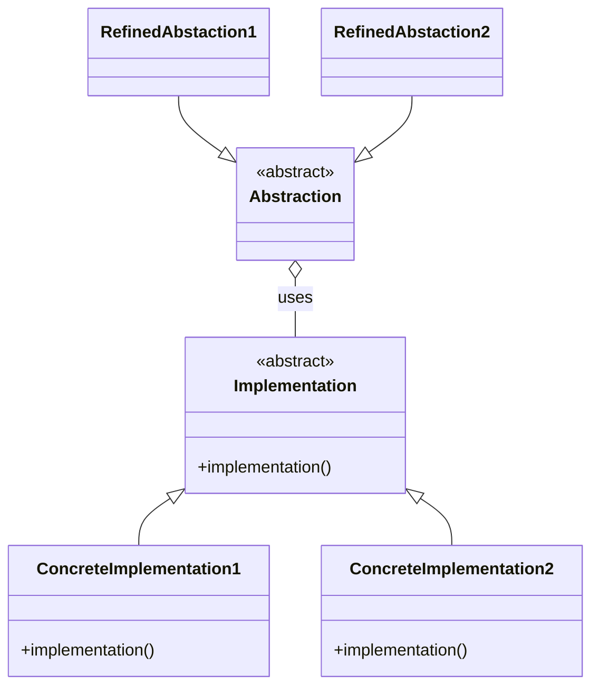

# Mediaticon-sviluppatori
Progetto Mediaticon - Repository privata programmatori
 
 

 
 
 
 

# Git help
   * `git clone <link>` copy all the repository in the current path

   * `git checkout <branch-name>` move to branch
   * `git checkout -b <branch-name>` create a new branch

   * `git branch -D <branch-name>` delete branch

   * `code .` open editor

   * `git status` check status of branch
   * `git add -A` add all changes
   * `git commit -m "comment"` commit all changes with comment

   * `git push` #push all changes
   * `git push origin <branch-name>` push all changes in branch

   * `git pull` update all
   * `git pull origin <branch-name>` update a branch of the local repository (from another branch)
   
   * `git push -f origin <branch to copy>:<branch to paste>` make a branch equal to another

# Ideas for documentation
## Mermaid

# Cose veramente utili (non come quanto scritto sopra, ovviamente VL scherza)
## Mediaticon DB
### Informazioni
Mediaticon DB è il gestore del database che mediaticon app utilizzerà per prelevare le informazione dei contenuti.
Il software serve principalmente per effettuare i download dei file csv e successivamente aggiornare il database con quanto appena scaricato.
Inoltre sono presenti metodi sia per la gestione della guida tv sia per l'implementazione della lista di contenuti selezionati dall'utente.
### Classi & Utilizzi
#### Download
La Classe download contiene i metodi utili per l'acquisizione dei file "CSV", i quali contengono i contenuti cinematografici.
In aggiunta, sono presenti costrutti adibiti al controllo delle eccezioni e all'"Error Correction". Pertanto il programma è in grado di evitare errori nella scrittura del database, i quali, essendo i titoli ordinati per 'data di uscita', corromperebbero l'intero sistema.
## Mediaticon APP
### Informazioni
### Finestre
#### Login
#### MainWindow
#### Description Window
#### MyListWindow
## Mediaticon Server
## Mediaticon Dependency installers
